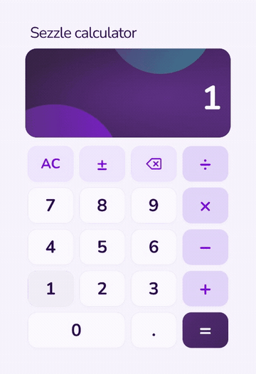
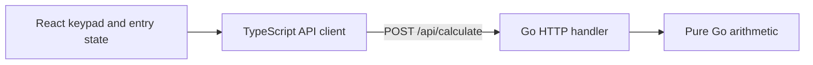

# Sezzle calculator

A calculator built with React, TypeScript, and a Go HTTP service. The frontend handles numeric entry; the backend performs addition, subtraction, multiplication, and division.

**[Open the live calculator](https://sezzle-calculator-ur1z.onrender.com)** · [Backend health](https://sezzle-calculator-api-bf7n.onrender.com/healthz)

The [repository](https://github.com/KallasLima/sezzle-calculator), prompt record, and demo files are public. No GitHub account or invitation is required to read or download them.

Free hosting can take about a minute to start the API on the first calculation. The demo below uses a warmed backend.

## Demo

[](docs/demo.mp4)

[53-second video](docs/demo.mp4) · [Still screenshot](docs/deployed-calculator.jpg)

The captioned video shows keypad input, left-to-right chaining, keyboard editing, division-by-zero recovery, and the mobile layout. Use **Download raw file** on GitHub's MP4 page to watch it locally.

Try it in 30 seconds: enter `12 × 2 =` to get `24`, press AC, then type `2 + 3 * 4 =` to get `20`. Try `8 ÷ 0 =`, press Backspace, enter `2`, and retry to get `4`.

## Run locally

Install [Go 1.26+](https://go.dev/doc/install) and [Node.js 24.15+ with npm](https://nodejs.org/en/download). Tested with Go 1.27.1 and Node 24.19.0 on Windows.

Clone the public repository, or download and extract its ZIP from GitHub:

```sh
git clone https://github.com/KallasLima/sezzle-calculator.git
cd sezzle-calculator
go version
node --version
npm --version
npm run doctor
npm run setup
npm run dev
```

`doctor` checks prerequisites; `setup` installs the locked frontend dependencies. Open <http://127.0.0.1:5173>; the API runs at <http://127.0.0.1:8080>. Press **Ctrl+C** to stop both services.

To run them separately after setup, use two terminals:

```sh
# Backend
cd backend
go run ./cmd/server
```

```sh
# Frontend
cd frontend
npm run dev
```

Vite proxies `/api` to Go. Leave `VITE_API_BASE_URL` unset locally. Press Ctrl+C in each terminal to stop the separate services.

If startup fails, run `npm run doctor` and check that ports 5173 and 8080 are available. Reopen the terminal after installing a runtime, or rerun `npm run setup` for missing dependencies. For failed calculations, check the backend terminal and <http://127.0.0.1:8080/healthz>.

## Verify

From the repository root after setup:

```sh
npm run verify
```

This checks formatting, then runs Go tests, coverage, vet, and build, followed by frontend tests, coverage, TypeScript checking, and the production build.

After `npm run setup`, use `npm run format` to format authored JavaScript, TypeScript, CSS, and JSON, or `npm run format:check` to check them. The pinned Prettier dependency is installed with the frontend; no separate root install is needed. Generated files and the verbatim prompt record are excluded. Use `gofmt` for Go.

HTML coverage reports:

- Backend: `backend/coverage/coverage.html`
- Frontend: `frontend/coverage/index.html`

Individual checks can also run from each layer's directory:

```sh
# backend/
mkdir coverage
go test ./... -count=1 '-covermode=atomic' '-coverprofile=coverage/coverage.out'
go tool cover '-html=coverage/coverage.out' -o coverage/coverage.html
go vet ./...
go build ./...
```

Create `coverage` only if it does not already exist. The quoted flags work in PowerShell.

```sh
# frontend/
npm run test:coverage
npm run typecheck
npm run build
```

Results from October 2, 2026:

| Check | Result |
| --- | --- |
| Frontend | 79 tests passed; 100% statement, line, and function coverage; 98.96% branch coverage. |
| Backend | Tests passed; 94.2% overall statement coverage, with 100% for arithmetic, HTTP, and configuration. |
| Static checks and builds | Go vet/build, TypeScript checking, and Vite build passed. |
| Integration | 36 hosted API/health/CORS checks passed, plus browser checks for delayed chaining, cancellation, timeout/retry, keyboard input, and desktop/mobile layouts. |
| Setup | Fresh-clone setup, verification, startup, and shutdown passed on Windows. |

## API

`POST /api/calculate` accepts `add`, `subtract`, `multiply`, or `divide`:

```sh
curl -i http://127.0.0.1:8080/api/calculate \
  -H 'Content-Type: application/json' \
  -d '{"operation":"add","a":2,"b":3}'
```

PowerShell:

```powershell
Invoke-RestMethod http://127.0.0.1:8080/api/calculate -Method Post `
  -ContentType application/json -Body '{"operation":"add","a":2,"b":3}'
```

Success returns HTTP 200:

```json
{"result":5}
```

Invalid input returns HTTP 400:

```json
{"error":{"code":"DIVISION_BY_ZERO","message":"cannot divide by zero"}}
```

| Code | Meaning |
| --- | --- |
| `INVALID_INPUT` | Missing, null, nonnumeric, or non-finite operands; unsupported operation; malformed JSON. |
| `DIVISION_BY_ZERO` | The divisor is zero, including negative zero. |
| `RESULT_OUT_OF_RANGE` | The calculation produces a non-finite result. |

Zero, negative numbers, and decimals are accepted. Unknown fields and trailing JSON values are rejected; request bodies are limited to 1 MiB. `GET /healthz` returns `{"status":"ok"}`.

## Calculator behavior

- Operations execute left to right: `2 + 3 × 4 = 20`. Selecting another operator before entering the second operand replaces the pending operator.
- Incomplete operations and repeated equals do nothing. After a result, digits start a new calculation and operators continue from that result.
- Decimal presses preserve a trailing point and ignore duplicates. Sign toggles the current entry; backspace removes its last digit. Backspace after a result starts a fresh entry at `0`.
- Keyboard shortcuts: digits, `.`, `+`, `-`, `*`, `/`, `=`, Backspace, and Escape to clear. Enter calculates, or activates a focused keypad button. Space activates a focused button.
- Input during a chain is queued in order. AC cancels the request and clears the queue immediately.
- Errors preserve the failed operation for correction or retry and discard any queued continuation. Editing during a standalone equals request cancels that request.
- Slow requests show feedback after 8 seconds and time out after 90 seconds. Retry is explicit; operands are preserved.

## Design



The dependency direction keeps arithmetic independent of HTTP and React. The Go standard-library handler validates requests and translates results into JSON. The frontend separates accessible controls in `Calculator.tsx`, entry and pending-operation state in `useCalculator.ts`, and HTTP communication in `api.ts`.

Numeric entry stays as text to preserve decimal input and distinguish an entered zero from a missing operand. A FIFO queue serializes chained requests; cancellation and a request-identity check prevent late responses from overwriting cleared state. The two-operand API keeps the implementation small without an expression parser or persistence.

Both layers use IEEE 754 floating-point numbers. For example, `0.1 + 0.2` returns `0.30000000000000004`, and integers above `Number.MAX_SAFE_INTEGER` can lose precision. Results use ordinary floating-point arithmetic without arbitrary rounding; overflow is rejected.

The CSS layout follows the [design reference](docs/design-reference.png), with a bundled Nunito font, responsive keypad, and visible keyboard focus. [PROMPTS.md](PROMPTS.md) records the implementation prompts.

## Deployment

The demo uses a free Render Static Site and a Free Go Web Service. See [deployment configuration](docs/deployment.md) for build commands, environment variables, and manual redeployment.
