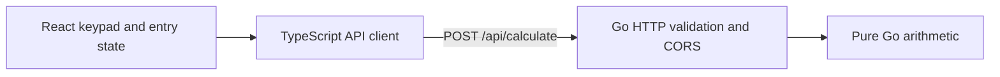

# Sezzle calculator

A calculator built with React, TypeScript, and a Go HTTP service. The frontend edits numeric input; the backend performs all four arithmetic operations.

**[Open the live calculator](https://sezzle-calculator-ur1z.onrender.com)** · [Backend health](https://sezzle-calculator-api-bf7n.onrender.com/healthz)

The free API can take about a minute to wake up on the first calculation. The display explains a slow request and preserves operands if a retry is needed. The recording below uses a warmed backend.

## Demo

[](docs/demo.mp4?raw=true)

[Watch or download the 53-second MP4](docs/demo.mp4?raw=true) · [Live calculator](https://sezzle-calculator-ur1z.onrender.com) · [Still screenshot](docs/deployed-calculator.jpg)

The captioned, silent recording shows real keypad input, left-to-right chaining, keyboard editing, division-by-zero recovery, and the mobile layout. The MP4 is 1080p H.264 (0.94 MB); the 8-second GIF preview is 160 KB. Media links require access to this private repository; download the MP4 if GitHub does not play it inline.

Try it in 30 seconds: enter `12 × 2 =` to get `24`, press AC, then quickly type `2 + 3 * 4 =` to get `20`. Try `8 ÷ 0 =`, correct the second operand, and retry. Tab to a key and use Enter or Space; Escape clears.

## Run locally

Source access is required because [the repository](https://github.com/KallasLima/sezzle-calculator) is private. An authorized reviewer can clone it with Git or download its ZIP from GitHub and extract it. No database, API keys, or other services are required locally.

```sh
git clone https://github.com/KallasLima/sezzle-calculator.git
cd sezzle-calculator
```

Install [Go 1.26+](https://go.dev/doc/install) and [Node.js 24.15+ with npm](https://nodejs.org/en/download), then reopen your terminal. The tested versions are Go 1.27.1 and Node 24.19.0; the frontend pins Node 24.19.0 for hosting.

From the repository root:

```sh
go version
node --version
npm --version
npm run doctor
npm run setup
npm run dev
```

`doctor` checks versions without installing system tools. `setup` installs the frontend's locked dependencies with `npm ci`; the Go backend uses only its standard library. No root dependency installation is needed. Open <http://127.0.0.1:5173>; the API listens on <http://127.0.0.1:8080>. Press **Ctrl+C** to stop both services. The runner uses fixed loopback ports and local API configuration, rejects occupied ports, and stops only its own children.

Alternatively, use two terminals after `npm run setup`. Start the backend:

```sh
cd backend
go run ./cmd/server
```

Start the frontend:

```sh
cd frontend
npm run dev
```

Vite forwards `/api` requests to Go, so local browser requests use one origin without CORS configuration. Press Ctrl+C in each terminal to stop this manual setup. Leave `VITE_API_BASE_URL` unset locally; it is a public build-time backend origin for separate hosting, without `/api`. The client strips trailing slashes and appends `/api/calculate`. Rebuild after changing it.

If a runtime is missing or too old, install it from the links above and check your PATH in a new terminal. If a port is busy, stop the service you started on that port. If dependencies are missing, rerun `npm run setup`. If calculations fail locally, check <http://127.0.0.1:8080/healthz>, the backend terminal, and that the frontend has no hosted API override.

## Verify

From the root, run `npm run verify`. This runs the commands below plus a separate normal frontend test run. It fails immediately on a failed check and creates both HTML coverage reports. It requires `npm run setup` first and never changes system runtimes.

Backend (from `backend/`; `mkdir coverage` is needed only on the first run):

```sh
mkdir coverage
go test ./... -count=1 '-covermode=atomic' '-coverprofile=coverage/coverage.out'
go tool cover '-func=coverage/coverage.out'
go tool cover '-html=coverage/coverage.out' -o coverage/coverage.html
go vet ./...
go build ./...
```

The quoted Go flags also work in PowerShell. Open `backend/coverage/coverage.html` for the annotated report; `coverage.out` is the machine-readable profile.

Frontend (from `frontend/`):

```sh
npm run test:coverage
npm run typecheck
npm run build
```

Open `frontend/coverage/index.html` for the HTML report. `coverage-summary.json` and `lcov.info` provide machine-readable results. Tests cover the API client and user interactions; the DOM bootstrap is excluded from frontend unit coverage. Generated reports, dependencies, and builds are ignored by Git.

Automated checks rerun October 2, 2026, after the hosting configuration and timeout changes, using `npm run verify` on Windows with Go 1.27.1 and Node 24.19.0:

| Check | Result |
| --- | --- |
| Go unit/handler tests | Passed; arithmetic, HTTP, environment configuration, and server construction have 100% statement coverage. |
| Go total coverage | 94.2%; the small server startup function is not unit tested. |
| Frontend tests | 79 passed in normal and coverage runs, without a timeout override; 100% statements, lines, and functions; 98.96% branches. |
| Static/build checks | `go vet`, `go build`, TypeScript checking, and Vite production build passed. |
| First run | Fresh Git clone: `setup`, `verify`, and `dev` passed on Windows. The local proxy returned `24` for `12 × 2`; Ctrl+C released both ports and removed the temporary server binary. |
| Slow-request UI (`cc3e77b`) | Local Go with simulated response latency: slow feedback fit at 320 × 568, AC cleared an intermediate request, keyboard recovery produced `20` for `2 + 3 × 4`, and no console errors were captured. |

The root scripts use Node's standard library and support Windows, macOS, and Linux. Windows was exercised here; macOS and Linux are documented but have not been tested. Two earlier Windows builds were blocked by Defender; the fresh-checkout verification and startup subsequently passed without changing security settings.

Hosted verification on October 2, 2026, against both services running application commit `3e8278f`:

| Check | Result |
| --- | --- |
| Public API | 28 arithmetic/validation cases and 8 health/CORS checks passed, including zero, decimals, missing input, division by zero, overflow, allowed/disallowed origins, and preflight. |
| Browser integration | Keypad `12 × 2 = 24`; rapid keyboard `2 + 3 × 4 + 6 = 26` with 1.5-second simulated latency and exactly three ordered hosted API requests; division-error correction; focused-button Enter/Space; AC during a delayed intermediate request and recovery all passed. |
| Slow requests | At 30-second simulated latency, the 8-second message remained readable. A request delayed beyond the deadline aborted at 90 seconds, retained operands, made no automatic retry, and succeeded after explicit retry. |
| Responsive UI and assets | Desktop 1440 × 900, mobile 390 × 844, and narrow 320 × 568 checked. All 19 keys fit without page overflow; refresh, JavaScript, CSS, and bundled fonts returned 200. No unexpected console or CORS errors. The linked still screenshot is from the deployed site. |

Coverage is a dated verification snapshot, not a guarantee of every possible behavior. The commands above regenerate the reports for future changes.

For a local production-build check, stop the combined runner, start Go separately, and run `npm run preview` from `frontend/` after building. Preview uses the same loopback URL and API proxy. Separately hosted static output must be built with `VITE_API_BASE_URL` set to the actual backend origin.

## API

`POST /api/calculate`, with `Content-Type: application/json`:

```json
{"operation":"add","a":2,"b":3}
```

```sh
curl -i http://127.0.0.1:8080/api/calculate \
  -H 'Content-Type: application/json' \
  -d '{"operation":"add","a":2,"b":3}'
```

PowerShell equivalent:

```powershell
Invoke-RestMethod http://127.0.0.1:8080/api/calculate -Method Post `
  -ContentType application/json -Body '{"operation":"add","a":2,"b":3}'
```

Success is HTTP 200:

```json
{"result":5}
```

Operations are `add`, `subtract`, `multiply`, and `divide`. Operands must be finite JSON numbers; zero, negative values, and decimals are accepted. Missing operands are never defaulted to zero. Invalid requests return HTTP 400:

```json
{"error":{"code":"DIVISION_BY_ZERO","message":"cannot divide by zero"}}
```

| Code | Meaning |
| --- | --- |
| `INVALID_INPUT` | Missing/null or nonnumeric operands, unsupported operation, malformed JSON, or a number outside the finite input range. |
| `DIVISION_BY_ZERO` | The divisor is zero, including negative zero. |
| `RESULT_OUT_OF_RANGE` | Finite operands produce an infinite or NaN result. |

Unknown fields and trailing JSON values are rejected. Request bodies are limited to 1 MiB. Other calculation methods return 405 with `Allow: POST`, except valid CORS preflights; unknown routes return 404. `GET /healthz` returns HTTP 200 with `{"status":"ok"}`.

Backend `HOST` and `PORT` default to `127.0.0.1:8080`; the port must be 1–65535. For separate browser hosting, set `ALLOWED_ORIGIN` to the exact frontend origin with no path or trailing slash. Allowed browser origins receive CORS headers on success and error responses; preflights allow POST with Content-Type. No wildcard or credentials are supported. Requests without Origin still work. CORS controls browser response access and is not authentication.

## Calculator behavior

- The display starts at `0`; input remains text, preserving decimal entry and an explicitly entered second operand of zero.
- Operators execute immediately from left to right. `2 + 3 × 4 =` produces `20`. Selecting another operator before entering the second operand replaces the pending operator.
- Equals with no pending operation or no second operand does nothing. Repeated equals does nothing; it does not replay the last operation.
- A digit after a completed result starts a new calculation. An operator continues from the result.
- Decimal entry preserves a trailing decimal point and ignores repeated decimal presses. Sign toggling edits the current number; while waiting for a second operand it begins that operand at `-0`.
- Backspace edits an entry and returns an emptied entry to `0`. While waiting for a second operand it does nothing. After a completed result it starts a fresh entry at `0`.
- During a chained calculation, the keypad stays enabled. Digits, edits, operators, and equals are queued in order while awaiting each backend result. Only one request runs at a time. The display shows the operation being evaluated; queued input appears as its preceding requests complete.
- AC immediately clears the entire calculation, cancels the pending request, and discards queued input. A late response cannot restore cleared or superseded state.
- After 8 seconds, a pending request says the free demo service may be starting. Each request times out after 90 seconds, preserving its operands for an explicit retry. AC cancels the request and feedback timers. There are no automatic retries or keep-alive requests.
- A failed chain keeps the failed operation available for correction or retry and visibly reports that queued input was cleared. Re-enter the continuation after correcting the error; it is never applied to the wrong operands.
- For an ordinary equals request outside a chain, operators and equals remain disabled to prevent duplicate submissions. Editing a number cancels the pending response and keeps the edited operands available for a new calculation. Errors preserve operands for correction or retry.
- Long numbers scroll inside the display, keeping the latest digits visible without moving the keypad. Focus the display to scroll it with arrow keys.
- Keyboard input supports digits, `.`, `+`, `-`, `*`, `/`, `=`, Backspace, and Escape to clear. Enter and Space activate the focused keypad button once; Enter acts as equals when focus is outside the keypad buttons. All keypad buttons are real focusable controls with accessible names.

## Design rationale

The structure follows the dependency principle without extra layers: pure Go arithmetic has no HTTP or UI dependencies; the HTTP handler validates and translates requests around that logic. The React UI delegates network communication to a separate API client and keeps entry/pending-operation state separate from arithmetic. There is no local fallback calculation, expression parser, database, authentication, persistence, or Docker setup.



`frontend/src/Calculator.tsx` renders accessible controls; `useCalculator.ts` handles input and queued transitions; `api.ts` owns network requests. `backend/internal/calculator` is pure arithmetic, `internal/httpapi` handles transport, and `cmd/server` reads environment configuration and starts HTTP. Each layer has its own tests.

The backend uses only the Go standard library. Vite handles local development/builds, and Vitest with Testing Library tests behavior through accessible controls. The calculator hook separates text entry modes, pending operations, and asynchronous evaluation. A chain owns a simple ordered input queue; replay pauses whenever another backend request starts and resumes after its result. Request cancellation uses both an `AbortController` and a request-identity guard, because cancellation alone cannot prevent an already-completing response from overwriting a clear or edit. The rounded font ships with the frontend, avoiding a runtime font-service dependency.

Ordinary IEEE 754 binary floating-point arithmetic is used in both Go (`float64`) and JavaScript (`number`). Decimal fractions are not always exact: `0.1 + 0.2` returns `0.30000000000000004`; integers beyond `Number.MAX_SAFE_INTEGER` may lose precision. Results are not arbitrarily rounded. Overflow is rejected, while ordinary finite underflow and floating-point rounding follow the runtime's behavior. This is not a financial decimal calculator.

The [supplied reference](docs/design-reference.png) guides the lavender surfaces, purple display, rounded keypad, and typography. The application uses React controls and CSS, never the image as its interface. The complete heading is a single text element. The [prompt record](PROMPTS.md) covers implementation and follow-up requests, identifies privacy redactions, and lists the separate planning/image-generation material still needed for full AI-assistance disclosure.

## Render configuration

Both services use this private repository's `main` branch. Commands and output paths below are relative to each service's Root Directory.

| Setting | Go Web Service | React Static Site |
| --- | --- | --- |
| Plan/type | Free Web Service, native Go | Free Static Site |
| Service ID | `srv-db05qdtg1s2s73cmlao0` | `srv-db05rjid0e5s73a7l5r0` |
| Root Directory | `backend` | `frontend` |
| Build Command | `go version && go build -o bin/server ./cmd/server` | `npm ci && npm run build` |
| Start / Publish | `./bin/server` | `dist` |
| Health Check Path | `/healthz` | Not applicable |
| Auto-deploy / automatic PR previews | Off / Off | Off / Off |
| Environment | `HOST=0.0.0.0`; Render supplies `PORT`; `ALLOWED_ORIGIN` is the actual frontend HTTPS origin | `SKIP_INSTALL_DEPS=true`; `VITE_API_BASE_URL` is the actual backend HTTPS origin |
| Runtime version | Render's stable Go; check build-log `go version` against `go.mod` | `.node-version` pins `24.19.0` |

The API base has no `/api` suffix. The allowed origin has no path or trailing slash. These configuration values are public, and the browser sends no credentials. No SPA catch-all, database, disk, Docker image, custom domain, or keep-alive service is needed.

The deployed values are `VITE_API_BASE_URL=https://sezzle-calculator-api-bf7n.onrender.com` and `ALLOWED_ORIGIN=https://sezzle-calculator-ur1z.onrender.com`. Render's build logs confirmed Go 1.27.1 on Linux and the pinned Node 24.19.0. The workspace build-minute spending limit is $0; there are no paid service instances.

For a manual redeploy, run verification, commit and push to `main`, then use **Manual Deploy → Deploy latest commit** in each affected service's Render Dashboard. Compare the deployed commit IDs with the intended commit. Changing `VITE_API_BASE_URL` requires rebuilding the static site; changing `ALLOWED_ORIGIN` requires redeploying the backend. Preserve other variables when updating configuration. If origins change, update both sides and verify a browser calculation, not just service status.

[Free Render web services](https://render.com/docs/free) sleep after 15 minutes without traffic and can take about a minute to restart. Shared monthly instance-hour, build-minute, and bandwidth limits apply; exhausted allowances can interrupt the demo. Keep the deployment within free allowances and avoid paid upgrades or billing-enabled overages. There are no uptime guarantees or background requests to prevent sleeping. The UI explains slow requests after 8 seconds and allows an explicit retry after its 90-second timeout.

See Render's [web services](https://render.com/docs/web-services), [static sites](https://render.com/docs/static-sites), [monorepo support](https://render.com/docs/monorepo-support), and [runtime versions](https://render.com/docs/language-support) documentation.
